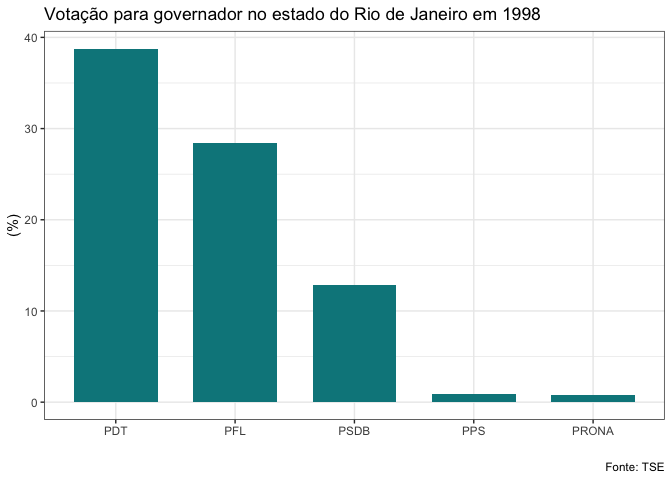
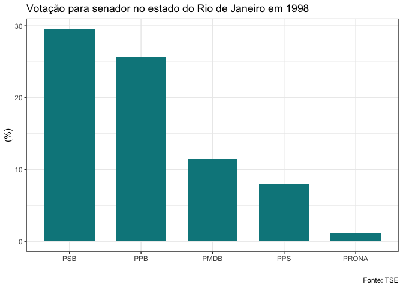
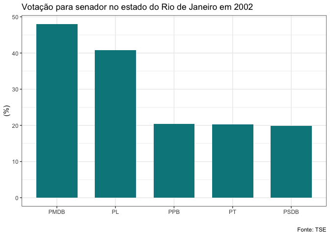
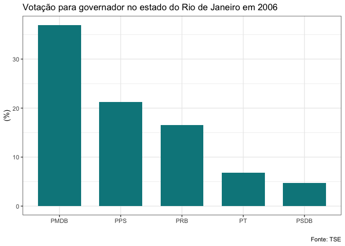
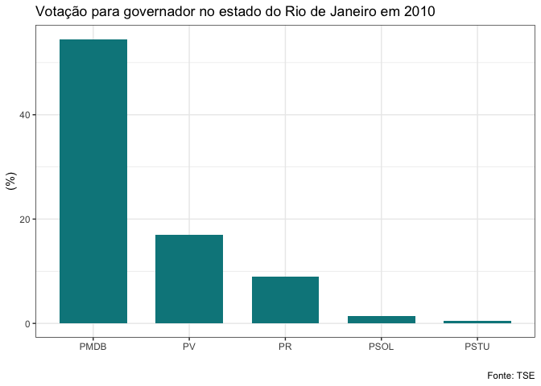
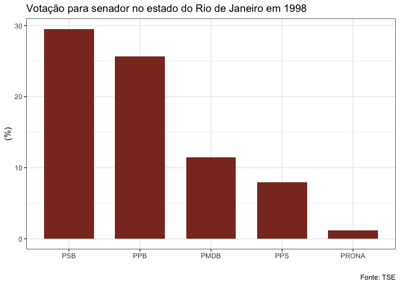
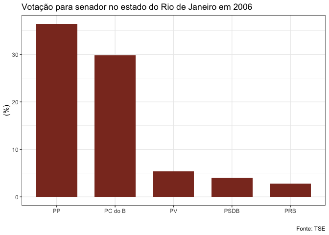
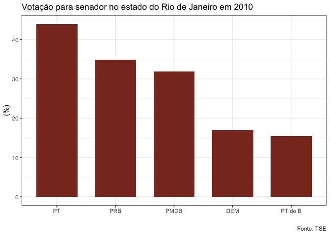

Automatização de códigos em R para cientistas sociais: uma introdução
================

Quando alguém tenta nos convencer de migrar nossas análises estatísticas
de softwares como SPSS e Stata para programação em R, geralmente essas
são as razões que o sujeito enumera:

1.  É totalmente 0800. Você não precisa ficar hackeando número de
    registro nem usando versão antiga de software.

2.  O R tem uma comunidade ativa de pesquisadores e desenvolvedores que
    aperfeiçoam a linguagem continuamente e geram um extenso material de
    apoio (gratuito) e documentação. Consequentemente, você tem muito
    mais recursos e flexibilidade para rodar suas análises em R do que
    teria em um software engessado com apenas algumas dezenas de
    funcionalidades.

3.  É possível automatizar o tratamento dos dados e análises, o que
    evita possíveis erros manuais, torna o código mais sucinto e “limpo”
    e facilita a reprodução das análises por outros pesquisadores.

Se você é de humanas como eu, você provavelmente entendeu e concordou
com os itens 1 e 2 mas boiou no 3. A questão é que o item 3 entra em um
campo mais complexo para iniciantes e não-técnicos pois pressupõe certo
conhecimento da lógica da programação em R. Por mais que os benefícios
de se aprender a linguagem sejam muitos, a curva de aprendizagem é longa
e exige tempo. O cientista social está preocupado com o seu problema de
estudo e a programação é apenas um instrumento, um meio para realizar
sua análise. Assim, perdido nos vários trade-offs de como utilizar seu
tempo, aprender a automatizar scripts no R acaba não entrando em sua
lista de prioridades. Outro obstáculo é que toda a documentação da
linguagem, assim como a maior parte do material de apoio, é em inglês e
o nível de detalhamento das explicações costuma não ser suficiente para
o iniciante.

De forma simples e não-técnica, o que quero dizer com “automatizar
códigos” é simplesmente produzir um único bloco de código para realizar
uma atividade várias vezes. Ou seja, ao invés de produzir um código para
realizar uma alteração em um banco de dados X e copiar e colar esse
código para fazer esta mesma alteração em um banco de dados Y, em um
código automatizado você define o bloco de código e altera os dois
bancos de uma só vez. Nada de Ctrl+C Ctrl+V\! Por isso o seu script será
mais sucinto e limpo, porque não haverá duplicação de código, ao mesmo
tempo que se elimina a possibilidade de erro manual.

#### O que é este material?

Neste material você encontrará noções básicas para começar a desenvolver
códigos automatizados em R. Desenvolvi um tutorial com um cenário mais
próximo possível do que um cientista social encontrará no seu dia a dia
de trabalho. Iremos coletar, tratar e criar gráficos descritivos para as
eleições majoritárias locais no estado do Rio de Janeiro (governador e
senador) em quatro eleições. O material não é exaustivo; meu objetivo é
apresentar de forma mais detalhada a lógica de programação em R e apenas
introduzir os principais elementos, pacotes e funções que lhe permitirão
automatizar seus códigos. Porém, você encontrará ao longo da leitura
links com material adicional sobre os tópicos e pacotes abordados.

#### Para quem este material se destina?

Este tutorial se destina a usuários com conhecimento básico a
intermediário de R. Estou assumindo que você é capaz de limpar dados
com dplyr, plotar gráficos básicos com ggplot e rodar estatísticas
descritivas com a base do R. Recomendo que vá lendo e rodando os códigos
de forma sequencial para compreender o raciocínio por trás das
atividades. Você pode baixar o script aqui “COLOCAR O LINK PARA O
GITHUB”, mas sugiro ir digitando o código e incluindo comentários no
seu script com suas próprias palavras. Por experiência própria, acho que
esta é a melhor forma de aprender a programar.

#### Como o material está estruturado?

O material está dividido em duas seções:

1.  Breve revisão de alguns tópicos que serão essenciais para o
    tutorial:

<!-- end list -->

  - vamos tratar rapidamente de algumas estruturas de dados em R:
    vetores, listas e dataframes;
  - vamos falar de funções e como criá-las;
  - definiremos o que é iteração. Para isso vamos tratar brevemente de
    programação imperativa com loop for, e de programação funcional com
    a família de funções apply (mais particularmente do lapply) e o
    pacote purrr (especificamente a função map).

<!-- end list -->

2.  Aplicação prática desses tópicos no tutorial:

<!-- end list -->

  - baixaremos dados eleitorais para o estado do Rio de Janeiro usando o
    pacote electionsBR;
  - faremos a limpeza de quatro bancos de dados simultaneamente,
    automatizando os códigos com funções criadas por nós e aplicadas aos
    bancos com a função map do purrr;
  - por fim, vamos plotar oito gráficos de uma só vez com ggplot e
    purrr.

Vamos lá?

## Breve revisão de tópicos básicos do R

Resista a tentação de pular esta seção. Você deve estar se perguntando
por que precisa ver isso tudo de novo. Já ouvi diversos colegas
cientistas sociais que usam R dizerem que não sabem a utilidade de se
aprender vetores, listas, etc, se no final das contas praticamente só
utilizamos dataframes (no caso de quem trabalha com dados estruturados).
É disso que vou tratar aqui.

O R (assim como o Python) é uma linguagem de programação orientada à
objetos, ou seja, tudo em R é um objeto. Objetos, por sua vez, são
estruturas de dados que podem ser vetores, listas, matrizes, dataframes
ou tibbles, funções, só para citar alguns tipos. Quando você abre o
console do R ou o RStudio você vê o que chamamos de ambiente
(environment) e qualquer objeto criado aí estará alocado no ambiente
global (global environment, R\_GlobalEnv ou .GlobalEnv) e pode ser
acessado ao ser “chamado”. Por exemplo, o objeto “nome” a seguir é um
vetor da classe characther com meu nome.

``` r
 nome<-c("Natalia", "Maciel", "Block")
```

Para vizualizar esse objeto basta “chamá-lo”:

``` r
nome
```

    ## [1] "Natalia" "Maciel"  "Block"

Eu posso saber a classe desse objeto utilizando a função da base R
“class” e o seu comprimento utilizando “length”.

``` r
class(nome)
```

    ## [1] "character"

``` r
length(nome)
```

    ## [1] 3

Ok, nada de novo até agora. Estou apenas revisitando alguns termos que
usaremos mais adiante. O R começa a ter utilidade quando você começa a
interagir diferentes tipos de estuturas de objetos. Em grande medida,
quando desenvolvemos um código automatizado introduzimos diferentes
estuturas de objeto como argumentos de funções criadas por nós. Por sua
vez, ao criarmos funções provavelmente teremos que criar objetos
temporários, que farão parte da função mas não estarão alocados no
ambiente global do R, sendo apenas utilizados quando chamarmos a função
criada. Por isso é importante entender esses primeiros conceitos e
principalmente as diferenças entre as estruturas de objetos.

#### Vetores, Listas e Dataframes

Vetores são as estruturas de dado mais básicas do R. Vetores podem ser
atômicos ou recursivos (também chamados de listas). Vetores atômicos
podem conter apenas elementos do mesmo tipo (logical, interger, double e
character), enquanto listas podem conter qualquer tipo de estrutura de
dados. Um vetor atômico é criado com c( ), como o objeto “nome” criado
anteriormente. Para criar listas, utilizamos a função list( ). Vejamos:

``` r
#criando um vetor double
meu_vetor<-c(0.14, 0.22, 3, 25)

meu_vetor
```

    ## [1]  0.14  0.22  3.00 25.00

``` r
#criando uma lista
minha_lista<-list(1:10, c(TRUE, FALSE,TRUE), data.frame(v1=(rnorm(20)), v2=rnorm(20)))

str(minha_lista)
```

    ## List of 3
    ##  $ : int [1:10] 1 2 3 4 5 6 7 8 9 10
    ##  $ : logi [1:3] TRUE FALSE TRUE
    ##  $ :'data.frame':    20 obs. of  2 variables:
    ##   ..$ v1: num [1:20] 1.97742 -0.00483 -0.36131 -2.06535 0.855 ...
    ##   ..$ v2: num [1:20] -1.096 -1.238 0.397 1.666 0.197 ...

A função srt( ) nos mostra a estrutura de um objeto. No objeto
“minha\_lista” podemos ver que existem 3 elementos, um sequencial
inteiro na primeira posição, um vetor logical na segunda e um dataframe
na terceira. Assim, vemos que listas comportam diferentes estruturas de
dados enquanto vetores podem receber apenas um tipo de dado. Podemos
identificar qual é o tipo de vetor utilizando a função typeof( )

``` r
typeof(meu_vetor)
```

    ## [1] "double"

``` r
typeof(nome)
```

    ## [1] "character"

E como acessamos um elemento de uma lista? Digamos que quero ver o vetor
logical inserido na lista. Sei que ele está na segunda posição, pois vi
quando rodei o str( ). Assim, vamos acessá-lo desta forma:

``` r
minha_lista[[2]]
```

    ## [1]  TRUE FALSE  TRUE

Finalmente o nosso querido dataframe\! Dataframes são estruturas
bidimensionais constituídas de listas de vetores de igual comprimento. A
definição é complicada, mas ela nada mais é do que aquela tão conhecida
tabela que você abre no excel ou no SPSS. A informação relevante aqui é
que suas dimensões (colunas e linhas) são vetores.

O terceiro elemento da minha\_lista é um dataframe. Como podemos fazer
uma cópia deste banco em um objeto separado?

``` r
meu_banco<-minha_lista[[3]]

meu_banco
```

    ##             v1         v2
    ## 1   1.97742429 -1.0961445
    ## 2  -0.00482724 -1.2379890
    ## 3  -0.36131199  0.3968372
    ## 4  -2.06534909  1.6661458
    ## 5   0.85499912  0.1969394
    ## 6   0.80534663 -0.8223658
    ## 7  -1.99902340  0.9936042
    ## 8  -2.42504988 -0.3362340
    ## 9  -0.75046034  0.7416118
    ## 10  0.60915037  1.0766251
    ## 11 -0.94983190  0.4050944
    ## 12 -0.26043087  1.7963932
    ## 13  0.74597370 -1.3067226
    ## 14  0.89821265 -1.1474719
    ## 15  0.18361417  0.2784000
    ## 16  0.53949909  1.9732564
    ## 17 -0.96692612  1.3172188
    ## 18  0.27373347 -1.2778564
    ## 19  0.29194263  0.4208599
    ## 20 -0.46205301 -0.2365923

###### Material Adicional:

Caso queria se aprofundar nesses elementos básicos do R sugiro [o
capítulo 20 do já clássico R for Data Science de Wickham e
Grolemund](https://r4ds.had.co.nz/vectors.html#vector-basics). Se você
se sente seguro para uma explicação mais avançada leia o capítulo [Data
Structures do livro Advanced
R](http://adv-r.had.co.nz/Data-structures.html), também do Hadley
Wickham.

#### Funções

Nas palavras de Hadley Wickham [“funções permitem automatizar tarefas
comuns de forma mais poderosa e geral do que copiar e
colar”](https://r4ds.had.co.nz/functions.html#function-arguments).
Funções reduzem a duplicação, identificando padrões repetidos de código
e os extraindo em partes independentes que podem ser atualizadas. Vamos
ver isso na prática.

No bloco de código abaixo estou criando um dataframe gerando uma massa
de dados aleatórios com uma distribuição normal (função rnorm, que tem
como default média= 0 e desvio padrão= 1). Estou arredondando os valores
para dois dígitos com a função round. A função set.seed( ) garante que
os dados gerados aqui serão os mesmos dados gerados por você na sua
máquina. A função head( ) nos dá as primeiras linhas do dataframe
criado.

``` r
set.seed(16)

dados<-data.frame(col1= round(rnorm(100),2),
               col2= round(rnorm(100),2),
               col3= round(rnorm(100),2))

head(dados)
```

    ##    col1  col2  col3
    ## 1  0.48  1.72 -0.36
    ## 2 -0.13  0.56  1.17
    ## 3  1.10  2.63 -0.52
    ## 4 -1.44  0.50  0.64
    ## 5  1.15  0.08 -1.53
    ## 6 -0.47 -0.76  0.23

Digamos que eu quisesse calcular a média de cada uma das colunas. A base
do R tem a função mean( ) para fazer isso, mas suponhamos que ela não
existisse e tivéssemos que elaborar a fórmula. Como seria? No nosso
numerador vamos somar os valores de cada elemento (soma das linhas) e o
denominador será o número de elementos da distribuição (total de
linhas). Assim, para a soma utilizarei a função sum( ) e para contar os
elementos utilizarei length( ) que apresentei na seção anterior. Para
calcular a média de col1 teríamos:

``` r
sum(dados$col1)/length(dados$col1)
```

    ## [1] 0.0593

Para ver se fizemos certo vamos checar com a função mean( )

``` r
mean(dados$col1)
```

    ## [1] 0.0593

Perfeito\! E agora? Como calculamos o resto das médias? Você
provavelmente copiaria e colaria a fórmula que criou alterando o nome
das colunas, certo? Aqui temos poucas colunas, mas imagine em um banco
com 10 variáveis\! Isso vai tomar muito do seu tempo e aumentar a
possibilidade de erro manual. Além disso, seu código vai ficar
gigantesco e horrível de ler. Para evitar essas repetições vamos criar
uma função que chamarei de “minha\_media”.

``` r
minha_media<-function(coluna){
  sum(coluna)/length(coluna)
}
```

Vamos analisar como essa função foi feita. Antes de tudo estamos
atribuindo a função ao objeto minha\_media; este será o nome da função.
Para criar uma função em R chamamos function( ) e a operação a ser
realizada vem logo a seguir dentro dos colchetes. Dentro dos parênteses
estamos designando o que chamamos de argumentos da função, que dei o
nome de “coluna”. Argumentos são geralmente os dados que se quer
computar e outros argumentos suplementares que controlam os detalhes do
que será computado. Em nossa função minha\_media não necessitamos de
nenhum argumento suplementar, apenas os dados que estamos computando.
Normalmente argumentos suplementares serão detalhes do seu código que se
repetem ou outro conjunto de dados. Em minha\_media atribuimos o
argumento “coluna” porque são os elementos que se repetem na nossa
formúla, que serão as colunas do nosso banco de dados. Sei que essa
explicação é meio abstrata, mas isso ficará mais claro conforme formos
criando mais funções no tutorial.

Vamos ver se a nossa função roda direitinho?

``` r
minha_media(dados$col1)
```

    ## [1] 0.0593

O código está bem mais sucinto e fácil de compreender agora. Porém,
ainda temos um problema: para calcular a média das demais colunas
teremos que rodar a função minha\_media mais duas vezes, ou seja, não
eliminamos a repetição. É por isso precisamos entender o que é iteração.

###### Material Adicional:

Tratei de funções de maneria MUITO superficial, mas esta é uma peça
chave para a automatização de códigos. Para aprender mais detalhes você
pode fazer o tutorial interativo R Programming: The basics of
programming in R [do pacote swirl](https://swirlstats.com). Foi assim
que aprendi a fazer funções. Também recomendo o [capítulo 19 do R for
Data Science](https://r4ds.had.co.nz/functions.html).

#### Iteração

Iteração é o ato de realizar a mesma operação em múltiplas entradas de
dados, ou seja, trata-se de repetir a mesma operação em diferentes
colunas ou diferentes bancos de dados, por exemplo. A iteração pode ser
realizada por programação imperativa ou funcional.

A programação imperativa faz uso de estruturas de programação como o for
loop e o while loop, que torna a iteração bastante explícita no sentido
de que é possível literalmente ler como a iteração é feita. No entanto,
segundo Wickham, ela é muito verborrágica e acredito que seja por isso
que iniciantes são tão resistentes em utilizá-la.

Vamos ver como resolveríamos o nosso problema de calcular todas as
médias do nosso banco de dados utilizando o for loop.

``` r
output<-vector("double", ncol(dados))

for (i in seq_along(dados)){
  output[[i]]<-minha_media(dados[[i]])
}
```

O for loop tem três componentes:

1.  **A saída** output\<-vector(“double”, ncol(dados)): antes de rodar o
    loop é preciso definir o objeto que receberá a saída, ou seja, o
    resultado do loop. Chamei este objeto de output. É preciso definir
    que tipo de estrutura de dados será o seu resultado e alocar o
    espaço que ele tomará. Eu defini que meu resultado será um vetor
    double com o mesmo número de colunas do dataframe dados.

2.  **A sequência** for (i in seq\_along (dados)): aqui estou indicando
    sobre o que estamos iterando. A cada execução do loop for, i recebe
    um valor diferente da sequência de colunas do dataframe dados. Se
    fossemos traduzir para bom português o que está escrito nessa linha
    de código seria: “para cada i ao longo do dataframe dados”. Mais
    precisamente, i são os dados que queremos computar que, no nosso
    caso, serão as colunas do dataframe “dados”.

3.  **O corpo** output\[\[i\]\]\<-minha\_media(dados\[\[i\]\]): por fim,
    computamos os dados. Aqui estamos aplicando a função minha\_media a
    cada coluna do dataframe dados - minha\_media(dados\[\[i\]\]) - e
    atribuindo cada valor gerado a cada execução do loop ao vetor output
    que criamos anteriormente - output\[\[1\]\].

Vamos ver o resultado?

``` r
output
```

    ## [1] 0.0593 0.0190 0.0537

Em suma, para evitar o CtrC+CtrlV, primeiro definimos a função
minha\_media e a seguir aplicamos a função a todas as colunas do
dataframe de uma só vez utilizando o for loop. Mas o for loop, como
mencionei anteriormente, é muito verborrágico e tem uma estrutura muito
complexa. Não há nada de errado em utilizar essa estrutura de
programação, mas existe uma forma mais fácil e sucinta de fazer a
mesma operação. Para isso precisamos entender o que é programação
funcional.

Veremos com mais detalhes no tutorial que a linguagem R permite que
rodemos funções dentro de funções. Na verdade já fizemos isso
anteriormente ao criarmos o nosso dataframe dados. Vamos relembrar esse
código?

``` r
set.seed(16)

dados<-data.frame(col1= round(rnorm(100),2),
               col2= round(rnorm(100),2),
               col3= round(rnorm(100),2))
```

Neste bloco de código chamamos a função data.frame( ) para criar a
estrutura de dados e dentro dela chamamos a função round( ) para
arredondar valores criados pela função rnorm ( ). Chamamos isso de
programação funcional; ao invés de elaborar vários loops ou criar
diversas funções para realizar uma operação, inserimos funções dentro de
funções, muitas delas já disponíveis em pacotes ou na própria base do R.

Seguindo a lógica da programação funcional, existem dois pacotes
desenvolvidos para realizar iterações sem a necessidade de escrever
loops: a família de funções apply, da base do R, e as diversas funções
map do pacote purrr.

A lógica das funções apply e map são bem parecidas; ao chamá-las você
incluirá como argumentos os dados sobre os quais quer iteragir e a
função que irá computar estes dados. Para o problema que estamos
trabalhando aqui, de calcular as médias das colunas do dataframe dados,
faríamos o seguinte:

``` r
#utilizando lapply

resultado<-lapply(dados, minha_media)

resultado
```

    ## $col1
    ## [1] 0.0593
    ## 
    ## $col2
    ## [1] 0.019
    ## 
    ## $col3
    ## [1] 0.0537

``` r
#utilizando a função map do purrr

#caso não tenha o tidyverse ou purrr instalado rode: 
#install.packages("tidyverse")

library(tidyverse)
resultado2<-map(dados, minha_media)

resultado2
```

    ## $col1
    ## [1] 0.0593
    ## 
    ## $col2
    ## [1] 0.019
    ## 
    ## $col3
    ## [1] 0.0537

Como você pode ver as duas funções entregam o mesmo resultado. O que
estamos fazendo aqui é rodando funções dentro de funções: minha\_media
dentro de lapply e de map. Como resultado ambas entregam uma lista em
que cada posição estão as as médias de cada coluna. As funções fizeram
as mesmas iterações sobre as colunas do dataframe que fizemos com o for
loop acima, mas não de maneira explícita. Por isso nosso código fica
muito mais sucinto e compreensível.

Como estou utilizando um exemplo muito simples lapply e map acabam
parecendo iguais, mas não são. A operacionalização da família de funções
apply não é muito sistemática e por isso cada vez mais a comunidade R
tem migrado para as funções map do purrr. Além disso, o pacote purrr nos
dá maior flexibilidade para trabalhar com dados estruturados de forma
automatizada com tibbles, mas isso não será assunto deste tutorial (quem
sabe em um próximo?\!). Você verá no tutorial que a estrutura de
programação do apply e do purrr em contextos mais complexos é um tanto
diferente.

###### Material Adicional:

Quase não tenho utilizado as funções apply pois praticamente só utilizo
o purrr para iterações. Mas eu sou da época que o purrr não existia,
rsrs. Aprendi a utilizar o apply por tutoriais de internet e pela
documentação do R. Esses tutoriais já estão muito ultrapassados e não
vale a pena recomendá-los. Caso queira estudar com mais detalhes essas
funções recomendo a documentação do R. Digite no console do R:
help(“lapply”). Para mais detalhes sobre iteração, loops e funções map
sugiro [o capítulo sobre iteração do R for Data
Science](https://r4ds.had.co.nz/iteration.html).

## Tutorial: Eleições para governador e senador no estado do Rio de Janeiro

Hora de aplicar toda essa parafernalha na prática\! Vamos baixar dados
das eleições de 1998, 2002, 2006 e 2010 do estado do Rio de Janeiro,
limparemos os dados, calcularemos a porcentagem de votos recebidas pelos
partidos para governador e senador e elaboraremos gráficos de barras
comparando os cinco partidos mais bem votados em cada eleição por cargo.
Ou seja, ao fim teremos oito gráficos; quatro para a eleição de
governador e quatro para senador.

Escolhi essas quatro eleições porque no momento que criei esse tutorial
os banco de dados de 2014 e 2018 disponibilizados pelo TSE continham
problemas consideráveis como, por exemplo, a incompatibilidade do nome
das variáveis com os dados das colunas. Assim, decidi utilizar bancos de
dados mais antigos mas que eu sabia que eram consistentes.

Para este exercício vamos utilizar a caixa de ferramentas tidyverse, que
contém os pacotes dplyr, ggplot2, purrr, entre outros; o pacote janitor
para tabular dados; e o electionsBR para baixar os dados diretamente do
site do TSE.

``` r
#Não esqueça de apontar o seu diretório de trabalho
#setwd(/seu_diretorio_aqui)

#caso não tenha o pacote pacman rode o código comentado abaixo:
#install.packages("pacman")

library(pacman)
p_load(electionsBR, janitor, tidyverse)
```

Como baixamos os dados com o electionsBR? Vamos analisar dados de
votação para partido, entõ queremos os dados do banco de votação por
partido, município e zona disponibilizado pelo TSE. Assim, vamos
utilizar a função party\_mun\_zone\_fed. Os argumentos que esta função
recebe são o ano e a uf. A função retornará como resultado um dataframe.
Eu sei disso tudo porque li a documentação. Para ver detalhes dos dados
que você pode baixar e como utilizar as diversas funções [veja a
documentação do
pacote](https://cran.r-project.org/web/packages/electionsBR/electionsBR.pdf).
Como exemplo vamos baixar os dados das eleições de 1998.

``` r
el98<-party_mun_zone_fed(1998, uf="RJ")

head(el98)
```

    ## # A tibble: 6 x 21
    ##   DATA_GERACAO HORA_GERACAO ANO_ELEICAO NUM_TURNO DESCRICAO_ELEIC… SIGLA_UF
    ##   <chr>        <time>             <dbl>     <dbl> <chr>            <chr>   
    ## 1 10/03/2016   18:48:28            1998         1 ELEICOES 1998    RJ      
    ## 2 10/03/2016   18:48:28            1998         1 ELEICOES 1998    RJ      
    ## 3 10/03/2016   18:48:28            1998         1 ELEICOES 1998    RJ      
    ## 4 10/03/2016   18:48:28            1998         1 ELEICOES 1998    RJ      
    ## 5 10/03/2016   18:48:28            1998         1 ELEICOES 1998    RJ      
    ## 6 10/03/2016   18:48:28            1998         1 ELEICOES 1998    RJ      
    ## # … with 15 more variables: SIGLA_UE <dbl>, CODIGO_MUNICIPIO <dbl>,
    ## #   NOME_MUNICIPIO <chr>, NUMERO_ZONA <dbl>, CODIGO_CARGO <dbl>,
    ## #   DESCRICAO_CARGO <chr>, TIPO_LEGENDA <chr>, NOME_COLIGACAO <chr>,
    ## #   COMPOSICAO_LEGENDA <chr>, SIGLA_PARTIDO <chr>, NUMERO_PARTIDO <dbl>,
    ## #   NOME_PARTIDO <chr>, QTDE_VOTOS_NOMINAIS <dbl>, QTDE_VOTOS_LEGENDA <dbl>,
    ## #   SEQUENCIAL_LEGENDA <dbl>

Eu sei que ler documentação é muito chato, mas é uma boa prática para
que você saiba todas as possibilidades de operacionalização das funções,
principalmente quais argumentos ela recebe, que tipo de estruturas de
dados ela suporta e que tipo de estrutura de dados ela retorna. O help
da função party\_mun\_zone\_fed nos dá a relação de todas as variáveis
do banco (digite help(“party\_mun\_zone\_fed”) no console). Da leitura
da documentação sabemos que os bancos apresentam as mesmas variáveis,
com exceção de 2018. Desta forma, como os bancos apresentam estruturas
similares podemos criar scripts únicos para manipular os quatro bancos
de uma só vez.

Utilize o View(el98) para ver o banco por inteiro. Agora que está
familiarizado com a “cara” do banco e com a função party\_mun\_zone\_fed
lhe pergunto: como baixar os bancos das outras três eleições sem repetir
o código?

A documentação não impõem restrição quanto a estrutura de dados que a
função recebe como argumento. Desta forma criarei um vetor com os anos
eleitorais e o incluirei como argumento da função party\_mun\_zone\_fed
que, por sua vez, será chamada dentro da função lapply. Como vimos
anteriormente, lapply retorna uma lista. Assim, espero ter como
resultado uma lista, que chamarei de rj\_list, em que cada posição
conterá um banco de dados para cada ano.

Esse bloco de código vai demorar um tempo para rodar porque ele irá lá
no site do TSE e vai baixar os dados para os quatro anos. Tenha
paciência\!

``` r
#vetor salvando os anos que quero fazer download
anos<-c(1998,2002,2006,2010)

#fazendo download com lapply
rj_list<-lapply(anos, function(anos) party_mun_zone_fed(anos, uf="RJ"))
```

Agora você entende porque é tão importante estudar vetores e listas\!
Recapitulando: expliquei na revisão que lapply recebe como argumentos os
dados a serem computados e a função que irá alterar esses dados, certo?
O que fiz acima foi criar um vetor com os dados sobre os quais eu quero
que a iteração ocorra, que neste caso são os anos eleitorais. A função é
a party\_mun\_zone\_fed, que recebe como argumentos o ano e a uf. Assim,
repeti o vetor “anos” também como argumento de party\_mun\_zone. Tivemos
como retorno uma lista com os bancos de dados. Temos aí três elementos
apresentados na revisão: o uso de vetores, listas e programação
funcional.

Essa operação poderia ter sido realizada com o map do purrr. Farei isso
quando baixarmos os dados de comparecimento. Como acessamos os bancos de
dados dentro da lista? Eles são salvos dentro da lista pela ordem que
foram iterados. Então, na posição 1 está o banco de 1998 e na 4 o de
2010. Vamos verificar?

``` r
head(rj_list[[1]])
```

    ## # A tibble: 6 x 21
    ##   DATA_GERACAO HORA_GERACAO ANO_ELEICAO NUM_TURNO DESCRICAO_ELEIC… SIGLA_UF
    ##   <chr>        <time>             <dbl>     <dbl> <chr>            <chr>   
    ## 1 10/03/2016   18:48:28            1998         1 ELEICOES 1998    RJ      
    ## 2 10/03/2016   18:48:28            1998         1 ELEICOES 1998    RJ      
    ## 3 10/03/2016   18:48:28            1998         1 ELEICOES 1998    RJ      
    ## 4 10/03/2016   18:48:28            1998         1 ELEICOES 1998    RJ      
    ## 5 10/03/2016   18:48:28            1998         1 ELEICOES 1998    RJ      
    ## 6 10/03/2016   18:48:28            1998         1 ELEICOES 1998    RJ      
    ## # … with 15 more variables: SIGLA_UE <dbl>, CODIGO_MUNICIPIO <dbl>,
    ## #   NOME_MUNICIPIO <chr>, NUMERO_ZONA <dbl>, CODIGO_CARGO <dbl>,
    ## #   DESCRICAO_CARGO <chr>, TIPO_LEGENDA <chr>, NOME_COLIGACAO <chr>,
    ## #   COMPOSICAO_LEGENDA <chr>, SIGLA_PARTIDO <chr>, NUMERO_PARTIDO <dbl>,
    ## #   NOME_PARTIDO <chr>, QTDE_VOTOS_NOMINAIS <dbl>, QTDE_VOTOS_LEGENDA <dbl>,
    ## #   SEQUENCIAL_LEGENDA <dbl>

``` r
head(rj_list[[4]])
```

    ## # A tibble: 6 x 21
    ##   DATA_GERACAO HORA_GERACAO ANO_ELEICAO NUM_TURNO DESCRICAO_ELEIC… SIGLA_UF
    ##   <chr>        <time>             <dbl>     <dbl> <chr>            <chr>   
    ## 1 27/03/2015   13:22:55            2010         1 ELEIÇÕES 2010    RJ      
    ## 2 27/03/2015   13:22:55            2010         1 ELEIÇÕES 2010    RJ      
    ## 3 27/03/2015   13:22:55            2010         1 ELEIÇÕES 2010    RJ      
    ## 4 27/03/2015   13:22:55            2010         1 ELEIÇÕES 2010    RJ      
    ## 5 27/03/2015   13:22:55            2010         1 ELEIÇÕES 2010    RJ      
    ## 6 27/03/2015   13:22:55            2010         1 ELEIÇÕES 2010    RJ      
    ## # … with 15 more variables: SIGLA_UE <chr>, CODIGO_MUNICIPIO <dbl>,
    ## #   NOME_MUNICIPIO <chr>, NUMERO_ZONA <dbl>, CODIGO_CARGO <dbl>,
    ## #   DESCRICAO_CARGO <chr>, TIPO_LEGENDA <chr>, NOME_COLIGACAO <chr>,
    ## #   COMPOSICAO_LEGENDA <chr>, SIGLA_PARTIDO <chr>, NUMERO_PARTIDO <dbl>,
    ## #   NOME_PARTIDO <chr>, QTDE_VOTOS_NOMINAIS <dbl>, QTDE_VOTOS_LEGENDA <dbl>,
    ## #   SEQUENCIAL_LEGENDA <dbl>

Vamos dar nomes aos bancos dentro das listas para ficar mais fácil de se
referir a eles. Para isso vou utilizar a função names( ) que recebe um
vetor com os nomes que queremos dar para cada um dos bancos.

``` r
names(rj_list)<-c('el98', 'el02', 'el06', 'el10')

#Vamos dar uma olhada no banco de 2006?
head(rj_list$el06)
```

    ## # A tibble: 6 x 21
    ##   DATA_GERACAO HORA_GERACAO ANO_ELEICAO NUM_TURNO DESCRICAO_ELEIC… SIGLA_UF
    ##   <chr>        <time>             <dbl>     <dbl> <chr>            <chr>   
    ## 1 22/11/2018   19:24:53            2006         1 ELEICOES 2006    RJ      
    ## 2 22/11/2018   19:24:53            2006         2 ELEICOES 2006    RJ      
    ## 3 22/11/2018   19:24:53            2006         1 ELEICOES 2006    RJ      
    ## 4 22/11/2018   19:24:53            2006         2 ELEICOES 2006    RJ      
    ## 5 22/11/2018   19:24:53            2006         1 ELEICOES 2006    RJ      
    ## 6 22/11/2018   19:24:53            2006         1 ELEICOES 2006    RJ      
    ## # … with 15 more variables: SIGLA_UE <dbl>, CODIGO_MUNICIPIO <dbl>,
    ## #   NOME_MUNICIPIO <chr>, NUMERO_ZONA <dbl>, CODIGO_CARGO <dbl>,
    ## #   DESCRICAO_CARGO <chr>, TIPO_LEGENDA <chr>, NOME_COLIGACAO <chr>,
    ## #   COMPOSICAO_LEGENDA <chr>, SIGLA_PARTIDO <chr>, NUMERO_PARTIDO <dbl>,
    ## #   NOME_PARTIDO <chr>, QTDE_VOTOS_NOMINAIS <dbl>, QTDE_VOTOS_LEGENDA <dbl>,
    ## #   SEQUENCIAL_LEGENDA <dbl>

Caso prefira ver os dados em formato de tabela use a função
View(rj\_list$el98). Vá alterando o nome do banco depois do cifrão para
visualizar os demais.

Vamos começar a limpar e estruturar nossos bancos. Primeiro quero
colocar o nome dos cargos em disputa em letra minúscula pois eles
servirão de labels para os nossos gráficos mais adiante. Para isso
vamos usar a função tolower( ) para modificar a variável
DESCRICAO\_CARGO.

Caso ainda tenha dificuldade em pensar em como gerar um código geral
para alterar todos os bancos, sugiro que neste início comece criando o
bloco para um banco e tente generalizá-lo com base nesse primeiro
código. Ao longo do tempo e com a prática você não sentirá mais
necessidade de fazer este primeiro passo. Vamos ver como seria.

Primeiro vou desenvolver o código para aquele banco de 1998 que baixamos
anteriormente, o el98.

``` r
el98<-el98%>%
  mutate(DESCRICAO_CARGO=tolower(DESCRICAO_CARGO))

#vamos verificar?
tabyl(el98, DESCRICAO_CARGO)
```

    ##    DESCRICAO_CARGO    n   percent
    ##  deputado estadual 7559 0.2928143
    ##   deputado federal 7542 0.2921557
    ##         governador 3918 0.1517722
    ##         presidente 3136 0.1214798
    ##            senador 3660 0.1417780

Ok, já sabemos como alterar um banco. Como podemos generalizar esse
código para todos os bancos da lista rj\_list? Primeiro criarei uma
função com base neste código e a seguir irei aplicá-la à lista com a
função map. Sei que a variável DESCRICAO\_CARGO é a mesma em todos os
bancos, desta forma posso usá-la dentro da minha função.

``` r
minuscula<-function(lista_rj){
   temp<-lista_rj%>%
    mutate(DESCRICAO_CARGO=tolower(DESCRICAO_CARGO))
}
```

Chamei minha função de minuscula. O único argumento que ela receberá é a
lista. Veja que o argumento são os dados que quero computar. O objeto
temp é um objeto temporário, o que quer dizer que ele não está
disponível no ambiente global do R. Ele só é acessado quando utilizamos
a função minuscula, essa sim disponível no ambiente global (viu como a
revisão era importante?\!). Você pode dar qualquer nome a objetos
temporários e a argumentos de funções desde que não sejam nomes de
funções já existentes na base do R ou de algum outro pacote.

Com a minha função criada, agora posso aplicá-la à lista.

``` r
rj_list<-map(rj_list, minuscula)
```

Você pode abrir cada banco com o View como fizemos anteriormente. Mas
que tal darmos uma olhada em todas as alterações de uma só vez? Vou usar
o tabyl do janitor dentro da função map para tabularmos a variável
DESCRICAO\_CARGO de todos os bancos.

``` r
map(rj_list, ~tabyl(.x, DESCRICAO_CARGO))
```

    ## $el98
    ##    DESCRICAO_CARGO    n   percent
    ##  deputado estadual 7559 0.2928143
    ##   deputado federal 7542 0.2921557
    ##         governador 3918 0.1517722
    ##         presidente 3136 0.1214798
    ##            senador 3660 0.1417780
    ## 
    ## $el02
    ##    DESCRICAO_CARGO    n      percent valid_percent
    ##  deputado estadual 7582 3.454057e-01     0.3454214
    ##   deputado federal 7843 3.572958e-01     0.3573121
    ##         governador 2343 1.067377e-01     0.1067426
    ##            senador 4182 1.905152e-01     0.1905239
    ##               <NA>    1 4.555601e-05            NA
    ## 
    ## $el06
    ##    DESCRICAO_CARGO    n   percent
    ##  deputado estadual 7242 0.3140367
    ##   deputado federal 7281 0.3157279
    ##         governador 3398 0.1473483
    ##         presidente 2365 0.1025541
    ##            senador 2775 0.1203330
    ## 
    ## $el10
    ##    DESCRICAO_CARGO    n    percent
    ##  deputado estadual 6835 0.38819788
    ##   deputado federal 6828 0.38780031
    ##         governador 1578 0.08962345
    ##            senador 2366 0.13437837

Veja aqui que, como alertei anteriormente, map e lapply começam a
apresentar diferenças conforme a complexidade do contexto. Neste caso,
tabyl é uma função que recebe dois argumentos, o conjunto de dados e o
nome da variável que se quer alterar. O conjunto de dados será o mesmo
do argumento de map, que é a lista rj\_list. Assim, na estrutura do map,
tabyl deve ser incluído seguido de um til de forma que o map
interpretará .x como o mesmo conjunto de dados inserido como argumento
do map. E como eu sei disso? Porque li a documentação. Vamos fazer isso
juntos. Vamos começar interpretando a documentação do map:

``` r
??map
```

Leia a descrição, as formas de uso e os tipos de estrutura de dados que
os argumentos que a função recebem. O que a descrição da função nos diz
é que map recebe como argumentos .x, que deve ser uma lista ou um
vetor, e .f que é uma função, formula ou vetor (no nosso caso é uma
função) e dá como retorno uma lista. Neste sentido o .x é a nossa
lista rj\_list e .f é a função tabyl.

Agora vamos ler a documentação de tabyl:

``` r
??tabyl
```

Da leitura da documentação sabemos que tabyl recebe como argumentos dat
que será um dataframe e … que são os vetores, ou colunas do banco que
queremos sumarizar, e o retorno será um dataframe com a sumarização dos
dados. No entanto, estamos usando a função tabyl como um argumento de
map então os dataframes gerados por tabyl estão dentro de uma lista
gerada por map. Por isso, como você vê, temos no resultado o nome do
banco dentro da lista ($el98, $el02, etc) com os respectivos resultados
do tabyl.

Novamente, sei que é um saco ler documentação, mas é assim que você
aprenderá a programar com mais eficiência.

Antes de começarmos a tratar os bancos vamos verificar se eles são
realmente iguais. Podemos começar verificando se eles tem a mesma
quantidade de colunas. Para isso vou usar a função dim e aplicá-la a
todos os bancos com map.

``` r
map(rj_list, dim)
```

    ## $el98
    ## [1] 25815    21
    ## 
    ## $el02
    ## [1] 21951    21
    ## 
    ## $el06
    ## [1] 23061    21
    ## 
    ## $el10
    ## [1] 17607    21

Sim, elas têm a mesma quantidade de colunas. Mas será que as colunas são
iguais? Como podemos verificar se o nome das colunas são iguais sem ter
que abrir e vasculhar todos os bancos? Uma opção seria salvar o nome das
colunas de cada banco e depois compará-los. Faço isso a seguir:

``` r
#guardando o nome de todas as colunas
nome_col<-map(rj_list, colnames)

#verificando as colunas são iguais em todos os bancos
nome_col$el98==nome_col$el02
```

    ##  [1] TRUE TRUE TRUE TRUE TRUE TRUE TRUE TRUE TRUE TRUE TRUE TRUE TRUE TRUE TRUE
    ## [16] TRUE TRUE TRUE TRUE TRUE TRUE

``` r
nome_col$el02==nome_col$el06
```

    ##  [1] TRUE TRUE TRUE TRUE TRUE TRUE TRUE TRUE TRUE TRUE TRUE TRUE TRUE TRUE TRUE
    ## [16] TRUE TRUE TRUE TRUE TRUE TRUE

``` r
nome_col$el06==nome_col$el10
```

    ##  [1] TRUE TRUE TRUE TRUE TRUE TRUE TRUE TRUE TRUE TRUE TRUE TRUE TRUE TRUE TRUE
    ## [16] TRUE TRUE TRUE TRUE TRUE TRUE

O que fiz foi salvar todos os nomes das colunas com a função colnames,
aplicando-o à lista com map. O colnames salva um vetor com os nomes; os
vetores foram salvos na lista nome\_col com o map. A seguir comparei os
vetores. A comparação retorna um vetor boleano. Caso houvesse alguma
coluna diferente teríamos FALSE como retorno na posição em que o R
encontrasse a discrepância. Como tivemos apenas TRUE como retorno
estamos seguros de que todas as colunas apresentam os mesmos nomes nos
quatro bancos.

Enfim podemos começar a estruturar o banco. Queremos trabalhar apenas
com eleições majoritárias (governador e senador), no primeiro turno (no
caso de governador).

O que precisaremos fazer? 1) Selecionar as variáveis de interesse que
serão NUM\_TURNO, DESCRICAO\_CARGO, SIGLA\_PARTIDO,
QTDE\_VOTOS\_NOMINAIS; 2) Filtrar apenas primeiro turno e os cargos de
interesse (governador, senador); 3) Agrupar as linhas e somar o total de
votos por partido

Como seria se eu fizesse isso tudo para apenas um banco? Vamos continuar
testando no banco el98.

``` r
maj98<-el98%>%
  select(NUM_TURNO, DESCRICAO_CARGO, SIGLA_PARTIDO, QTDE_VOTOS_NOMINAIS)%>%
  filter(NUM_TURNO==1 & DESCRICAO_CARGO %in% c("governador", "senador"))%>%
  group_by(DESCRICAO_CARGO, SIGLA_PARTIDO)%>%
  summarise(votos=sum(QTDE_VOTOS_NOMINAIS))

glimpse(maj98)
```

    ## Rows: 27
    ## Columns: 3
    ## Groups: DESCRICAO_CARGO [2]
    ## $ DESCRICAO_CARGO <chr> "governador", "governador", "governador", "governador…
    ## $ SIGLA_PARTIDO   <chr> "PDT", "PFL", "PPS", "PRONA", "PRTB", "PSDB", "PSDC",…
    ## $ votos           <dbl> 3083441, 2256815, 74154, 63154, 7684, 1020765, 4515, …

Beleza\! A seguir, farei uma função, a limpa\_votos, com base nesta e a
aplicarei à lista rj\_list com map. Vou salvar o resultado em uma lista
separada, que chamarei de maj\_rj, para termos os dados brutos salvos
caso sejam necessários futuramente.

``` r
#Criando a função:

limpa_voto<-function(lista_votos){
  obj_temp<-lista_votos%>%
    select(NUM_TURNO, DESCRICAO_CARGO, SIGLA_PARTIDO, QTDE_VOTOS_NOMINAIS)%>%
    filter(NUM_TURNO==1 & DESCRICAO_CARGO %in% c("governador", "senador"))%>%
    group_by(DESCRICAO_CARGO, SIGLA_PARTIDO)%>%
    summarise(votos=sum(QTDE_VOTOS_NOMINAIS))
}

#aplicando à lista com map
maj_rj<-map(rj_list, limpa_voto)
```

Temos o nosso banco de votação pronto. Para calcularmos a porcentagem de
votos recebidos precisamos dos dados de comparecimento por ano. Eles
estão no banco detalhes de votação do TSE e podem ser baixados pelo
pacote electionsBR com a função details\_mun\_zone\_fed. Vou utilizar a
função map para isso. Repare que vou utilizar o mesmo vetor anos que
utilizei para baixar os dados de votação anteriormente.

``` r
comp_list<-map(anos, ~details_mun_zone_fed(.x,"RJ"))
```

A seguir irei nomear os bancos dentro da lista comp\_list, verificar se
os bancos são iguais e colocar os cargos da variável DESCRICAO\_CARGO em
letra minúscula, como fiz no banco
anterior.

``` r
#Nomeando os bancos dentro da lista. Vou dar o mesmo nome que dei aos bancos na lista rj_list
names(comp_list)<-c('el98', 'el02', 'el06', 'el10')
names(comp_list)
```

    ## [1] "el98" "el02" "el06" "el10"

``` r
#Verificando se as dimensões dos bancos são iguais
map(comp_list, dim)
```

    ## $el98
    ## [1] 1310   26
    ## 
    ## $el02
    ## [1] 1052   26
    ## 
    ## $el06
    ## [1] 1315   26
    ## 
    ## $el10
    ## [1] 1052   26

``` r
#Agora vou verificar se as colunas são iguais: 

#Salvando o nome de todas as colunas em uma lista com a função map
nome_col_comp<-map(comp_list, colnames)

#Verificando se os nomes das colunas são iguais em todos os bancos
nome_col_comp$el98==nome_col_comp$el02
```

    ##  [1] TRUE TRUE TRUE TRUE TRUE TRUE TRUE TRUE TRUE TRUE TRUE TRUE TRUE TRUE TRUE
    ## [16] TRUE TRUE TRUE TRUE TRUE TRUE TRUE TRUE TRUE TRUE TRUE

``` r
nome_col_comp$el02==nome_col_comp$el06
```

    ##  [1] TRUE TRUE TRUE TRUE TRUE TRUE TRUE TRUE TRUE TRUE TRUE TRUE TRUE TRUE TRUE
    ## [16] TRUE TRUE TRUE TRUE TRUE TRUE TRUE TRUE TRUE TRUE TRUE

``` r
nome_col_comp$el06==nome_col_comp$el10
```

    ##  [1] TRUE TRUE TRUE TRUE TRUE TRUE TRUE TRUE TRUE TRUE TRUE TRUE TRUE TRUE TRUE
    ## [16] TRUE TRUE TRUE TRUE TRUE TRUE TRUE TRUE TRUE TRUE TRUE

``` r
#Agora preciso colocar os cargos em letra minúscula.
#Não tem segredo; vamos utilizar a mesma função "minuscula" já criada e aplicá-la a lista
#comp_list com map.

comp_list<-map(comp_list, minuscula)

#por fim, vamos confirmar se a alteração foi feita

map(comp_list,~tabyl(.x, DESCRICAO_CARGO))
```

    ## $el98
    ##    DESCRICAO_CARGO   n percent
    ##  deputado estadual 262     0.2
    ##   deputado federal 262     0.2
    ##         governador 524     0.4
    ##            senador 262     0.2
    ## 
    ## $el02
    ##    DESCRICAO_CARGO   n percent
    ##  deputado estadual 263    0.25
    ##   deputado federal 263    0.25
    ##         governador 263    0.25
    ##            senador 263    0.25
    ## 
    ## $el06
    ##    DESCRICAO_CARGO   n percent
    ##  deputado estadual 263     0.2
    ##   deputado federal 263     0.2
    ##         governador 526     0.4
    ##            senador 263     0.2
    ## 
    ## $el10
    ##    DESCRICAO_CARGO   n percent
    ##  deputado estadual 263    0.25
    ##   deputado federal 263    0.25
    ##         governador 263    0.25
    ##            senador 263    0.25

Tudo está ok com os bancos. Hora de limpá-lo. O que precisamos fazer? 1)
Selecionar as variáveis que precisamos: NUM\_TURNO, DESCRICAO\_CARGO,
QTD\_COMPARECIMENTO; 2) Filtrar apenas primeiro turno e os cargos de
interesse (governador, senador); 3) Agrupar as linhas e somar o total de
votos por cargo. Como estamos trabalhando com primeiro turno os valores
serão iguais para os dois cargos.

Como já fizemos várias vezes anteriormente, farei uma função para limpar
o banco e a aplicarei à lista com map. Salvarei o resultado no objeto
comp\_rj para não alterar os dados brutos.

``` r
#criando a função
limpa_comp<-function(lista_comp){
  temp<-lista_comp %>%
  select(NUM_TURNO, DESCRICAO_CARGO, QTD_COMPARECIMENTO)%>%
  filter(NUM_TURNO==1 & DESCRICAO_CARGO %in% c("governador", "senador"))%>%
  group_by(DESCRICAO_CARGO)%>%
  summarise(comparecimento=sum(QTD_COMPARECIMENTO))
}

#aplicando à lista
comp_rj<-map(comp_list, limpa_comp)
```

Finalmente temos nossos dois bancos. Agora precisamos trazer o total de
comparecimento para os bancos de votação e fazer o cálculo da votação.
No bloco a seguir crio a função para isso.

``` r
calcula_comp<-function(lista_maj, lista_comp){
  lista_maj%>%
  left_join(lista_comp)%>%
    mutate(porc_voto=(round(votos*100/comparecimento, 2)))
}
```

Repare que na função que criei receberá como argumentos dois conjuntos
de dados distintos: a lista com os bancos de votação e a lista com os
bancos de dados de comparecimento. Desta forma, teremos dois conjuntos
de dados iterando com a função calcula\_comp. No caso de termos mais de
uma entrada de dados utilizamos outra função do purrr, a map2. Vejamos
na documentação como ela funciona:

``` r
??map2
```

A lógica é basicamente a mesma do map, mas como a função que criamos
recebe dois argumentos precisamos identificar na função map 2 quem o que
será cada argumento (.x e .y).

``` r
maj_rj<-map2(.x = maj_rj, .y = comp_rj, ~ calcula_comp(.x,.y))
```

    ## Joining, by = "DESCRICAO_CARGO"
    ## Joining, by = "DESCRICAO_CARGO"
    ## Joining, by = "DESCRICAO_CARGO"
    ## Joining, by = "DESCRICAO_CARGO"

Perfeito\! Estamos prontos para elaborar nossos gráficos. Queremos fazer
gráficos de barras comparando a votação dos cinco partidos mais bem
votados em cada eleição para cada cargo. Iremos, então, plotar ao total
oito gráficos: quatro para senador (1998, 2002, 2006, 2010) e quatro
para governador (idem). Desse modo, a nossa função terá que: 1) filtrar
o cargo; 2) elencar as cinco maiores votações; 3) transformar as siglas
dos partidos em fatores; 4) criar o gráfico de barras com ggplot2.

``` r
 gf_barras<-function(banco, ano, cargo){
   temp<-banco%>%
     filter(DESCRICAO_CARGO== cargo)%>%
     top_n(5)%>%
     arrange(desc(porc_voto))%>%
     mutate(SIGLA_PARTIDO=factor(SIGLA_PARTIDO, levels = unique(SIGLA_PARTIDO)))%>%
     ggplot()+
     geom_bar(aes(x=SIGLA_PARTIDO, y=porc_voto), stat = "identity", width = 0.7, fill="turquoise4")+
     labs(title=glue::glue("Votação para ", cargo," no estado do Rio de Janeiro em ", ano),
          x= " ",
          y= "(%)",
          caption = "Fonte: TSE") +
     theme(plot.title = element_text(size=12))+
     theme_bw()
 }
```

Veja que a função que criei recebe três argumentos: os bancos de dados
da lista, o ano da eleição e o cargo. Estes são os elementos que serão
alterados a cada vez que utilizarmos a função. O banco será a nossa
lista. Como iremos aplicar a função a todos os bancos de uma vez com o
map2, utilizaremos o vetor anos no argumento ano e o argumento cargo
receberá uma string com o nome do cargo que queremos, que deve ser
governador ou senador. Não vou explicar com detalhes os códigos do dplyr
e do ggplot utilizados aqui, mas quero ressaltar uma linha que é
bastante interessante. Veja que para adicionar o título estou usando a
função glue, que irá colar no texto que escrevi o nome do cargo e o ano
em cada iteração.

Vamos ver como ficou?

``` r
#plotando gráficos para eleição de governador
map2(.x= maj_rj,
     .y= anos,
     .f= ~gf_barras(.x, .y, "governador"))
```

    ## Selecting by porc_voto
    ## Selecting by porc_voto
    ## Selecting by porc_voto
    ## Selecting by porc_voto

    ## $el98

<!-- -->

    ## 
    ## $el02

<!-- -->

    ## 
    ## $el06

<!-- -->

    ## 
    ## $el10

<!-- -->

``` r
#agora para eleições de senador
map2(.x= maj_rj,
     .y= anos,
     .f= ~gf_barras(.x, .y, "senador"))
```

    ## Selecting by porc_voto
    ## Selecting by porc_voto
    ## Selecting by porc_voto
    ## Selecting by porc_voto

    ## $el98

<!-- -->

    ## 
    ## $el02

<!-- -->

    ## 
    ## $el06

<!-- -->

    ## 
    ## $el10

<!-- -->

Ficou é ótimo, mas uma coisa ainda me incomoda. Tenho todos os gráficos
com a mesma cor, acho que ficaria melhor se pudesse escolher cores
diferentes para cada cargo. Vou alterar a função que criei anteriormente
para receber um quarto argumento que será a cor que o ggplot irá receber
no aestetics fill para colorir as barras. Estou dando um outro nome a
esta função.

``` r
gf_barras_cor<-function(banco, ano, cargo, cores){
  temp<-banco%>%
    filter(DESCRICAO_CARGO== cargo)%>%
    top_n(5)%>%
    arrange(desc(porc_voto))%>%
    mutate(SIGLA_PARTIDO=factor(SIGLA_PARTIDO, levels = unique(SIGLA_PARTIDO)))%>%
    ggplot()+
    geom_bar(aes(x=SIGLA_PARTIDO, y=porc_voto), stat = "identity", width = 0.7, fill=cores)+
    labs(title=glue::glue("Votação para ", cargo," no estado do Rio de Janeiro em ", ano),
         x= " ",
         y= "(%)",
         caption = "Fonte: TSE") +
    theme(plot.title = element_text(size=12))+
    theme_bw()
}
```

Perceba que o argumento cores só irá receber nome de cores que são
suportadas pelo ggplot2.
[Aqui](http://sape.inf.usi.ch/quick-reference/ggplot2/colour) você
encontra a lista de cores que pode utilizar.

Eu vou manter essa cor verde nos gráficos de governador, mas quero uma
cor vermelha para os de senador.

``` r
map2(.x=maj_rj,
     .y=anos,
     .f= ~gf_barras_cor(.x, .y, "governador", "turquoise4"))
```

    ## Selecting by porc_voto
    ## Selecting by porc_voto
    ## Selecting by porc_voto
    ## Selecting by porc_voto

    ## $el98

<!-- -->

    ## 
    ## $el02

<!-- -->

    ## 
    ## $el06

<!-- -->

    ## 
    ## $el10

<!-- -->

``` r
map2(.x=maj_rj,
    .y=anos,
    .f= ~gf_barras_cor(.x, .y, "senador", "tomato4"))
```

    ## Selecting by porc_voto
    ## Selecting by porc_voto
    ## Selecting by porc_voto
    ## Selecting by porc_voto

    ## $el98

<!-- -->

    ## 
    ## $el02

<!-- -->

    ## 
    ## $el06

<!-- -->

    ## 
    ## $el10

<!-- -->

Sei que os códigos ficaram mais complexos ao longo do tutorial, mas vai
ficando mais fácil conforme você for praticando. Como em qualquer coisa
que se dispuser a aprender na vida, você irá cometer muitos erros no
início. Não é fácil, mas é totalmente possível se for persistente.
Espero que este material lhe dê os primeiros recursos de que precisa
para começar a entender a lógica de programação em R e a automatizar
códigos em seus próprios trabalhos. Boa sorte\!

###### Material Adicional:

Para ver com mais detalhes o purrr na prática sugiro [esse excelente
tutorial da Rebecca
Barter](http://www.rebeccabarter.com/blog/2019-08-19_purrr/?fbclid=IwAR1fF1sJ-9lhvMOIviXK_CQA73h1Cz97sIdQw21jaX52FxnnVE76YLKWe94).
Agora que você já sabe como trablhar com listas será super fácil limpar
seus bancos de dados em formato tibble com purrr.

Sugiro também [este
tutorial](https://aosmith.rbind.io/2018/08/20/automating-exploratory-plots/)
sobre como automatizar a criação de seus gráficos com ggplot2 e purrr.

Por fim, [este é o meu material de
referência](http://r-statistics.co/Top50-Ggplot2-Visualizations-MasterList-R-Code.html#Time%20Series%20Plot%20From%20a%20Time%20Series%20Object)
quando busco visualizações lindas e super interessantes com ggplot2.
